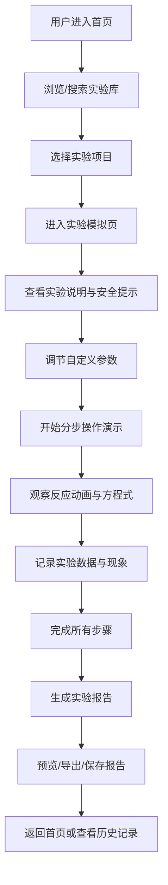

## 1. 产品概述

化学实验步骤模拟器是一款面向学生与科普爱好者的纯前端应用，通过 React + Mantine UI 打造科学实验室风格的交互式学习平台。用户可以选择常见化学实验，观看分步演示，了解化学反应原理，记录实验数据，并生成完整的实验报告。

- 核心价值：让化学实验学习更加安全、直观、有趣，无需真实实验器材即可掌握实验原理与操作流程
- 目标用户：中学生、大学生、化学科普爱好者、教师
- 市场定位：教育类科普工具，填补虚拟化学实验教学的空白

## 2. 核心功能

### 2.1 用户角色

| 角色 | 注册方式 | 核心权限 |
|------|----------|----------|
| 普通用户 | 无需注册，本地存储 | 浏览实验库、进行模拟实验、记录数据、生成报告 |

### 2.2 功能模块

1. **首页**：实验库展示、热门实验推荐、搜索筛选、快速开始入口
2. **实验模拟页**：实验器材可视化、分步操作演示、反应方程式展示、安全提示标注
3. **数据记录页**：实验数据录入、现象观察记录、参数自定义调整
4. **实验报告页**：报告自动生成、报告预览、导出/打印功能
5. **个人中心**：历史实验记录、收藏实验、本地数据管理

### 2.3 页面详情

| 页面名称 | 模块名称 | 功能描述 |
|----------|----------|----------|
| 首页 | 导航栏 | Logo、页面切换、主题切换、搜索框 |
| 首页 | 实验库 | 实验卡片网格展示、分类筛选、难度标签、搜索功能 |
| 首页 | 热门推荐 | 轮播展示精选实验、快速开始按钮 |
| 实验模拟页 | 器材展示区 | SVG 动画渲染烧杯、试管、酒精灯等器材，支持交互 |
| 实验模拟页 | 步骤导航 | 步骤列表、上一步/下一步、自动播放、进度指示 |
| 实验模拟页 | 信息面板 | 反应方程式、注意事项、安全警示、原理说明 |
| 实验模拟页 | 参数设置 | 浓度、温度、用量等可调节参数滑块 |
| 数据记录页 | 数据表格 | 可编辑数据表格、自动计算、单位转换 |
| 数据记录页 | 现象记录 | 富文本输入、时间戳标记、图片占位 |
| 实验报告页 | 报告预览 | 完整实验报告排版、数据汇总、结论生成 |
| 实验报告页 | 报告操作 | 导出 PDF/打印、保存到本地、分享 |
| 个人中心 | 历史记录 | 实验历史列表、查看详情、删除记录 |
| 个人中心 | 数据管理 | 清空数据、导出备份、导入恢复 |

## 3. 核心流程

用户从首页浏览实验库，选择感兴趣的实验后进入实验模拟页面，按照步骤引导完成虚拟实验操作，过程中可调节实验参数并观察化学反应动画。实验过程中记录数据与现象，完成后系统自动生成实验报告，用户可导出或保存报告。所有数据本地存储，支持后续查看与管理。

## 4. 用户界面设计

### 4.1 设计风格

- **主色调**：实验室蓝 (#1E6FBA) + 白色 (#FFFFFF) + 浅灰 (#F0F4F8)
- **辅助色**：安全红 (#E53935) 用于警示、成功绿 (#43A047) 用于确认、警告橙 (#FB8C00) 用于提示
- **按钮风格**：圆角 8px，微立体阴影，悬停有轻微上浮动画
- **字体**：标题使用 'JetBrains Mono' 等宽字体体现科技感，正文使用 'Noto Sans SC' 保证可读性
- **布局风格**：卡片式布局，清晰的区域分隔，实验室工作台质感背景
- **图标风格**：线性图标为主，配合实验器材 SVG 插画，科学严谨又不失趣味

### 4.2 页面设计概述

| 页面名称 | 模块名称 | UI 元素 |
|----------|----------|----------|
| 首页 | 导航栏 | 磨砂玻璃效果、深色/浅色模式切换、搜索框带放大镜图标 |
| 首页 | 实验卡片 | 悬停缩放、阴影加深、难度标签彩色、实验器材缩略图 |
| 首页 | Hero 区域 | 渐变背景、大标题带实验室元素装饰、动画按钮 |
| 实验模拟页 | 器材区 | 居中大尺寸 SVG 动画、反应过程有颜色变化、气泡动画 |
| 实验模拟页 | 步骤条 | 左侧垂直步骤导航、当前步骤高亮、已完成打勾 |
| 实验模拟页 | 反应方程式 | LaTeX 风格渲染、试剂标注、条件箭头动画 |
| 实验模拟页 | 安全提示 | 红边警告卡片、图标闪烁、可折叠详情 |
| 数据记录页 | 表格 | 可编辑单元格、斑马纹、实时计算结果高亮 |
| 实验报告页 | 报告预览 | 仿打印纸效果、页眉页脚、数据图表可视化 |
| 个人中心 | 时间线 | 实验历史时间线展示、卡片悬浮展开详情 |

### 4.3 响应式

- 桌面端优先设计，针对 1280px 及以上宽度优化
- 平板端：侧边栏折叠为图标按钮，内容区自适应
- 移动端：底部导航栏，实验模拟页改为上下布局，步骤导航改为横向滚动
- 触摸优化：按钮最小 44x44px，滑动手势支持步骤切换

### 4.4 动画与交互

- 页面加载：元素 staggered 渐入动画
- 实验器材：加热时有火焰摇曳动画、反应时有气泡上升、颜色渐变过渡
- 按钮交互：悬停缩放 1.03 倍，点击有下压反馈
- 步骤切换：平滑过渡动画，旧内容淡出，新内容淡入
- 进度指示：液体填充动画，百分比数字滚动
