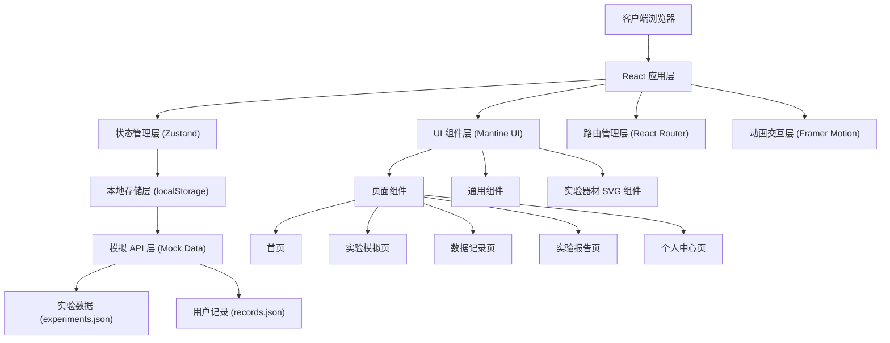
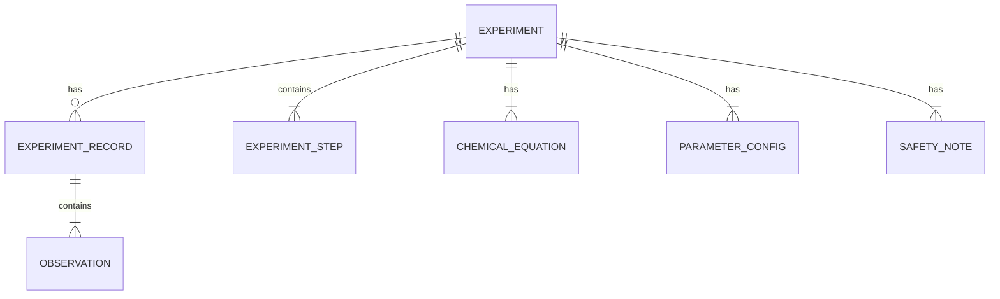

## 1. 架构设计



## 2. 技术描述

- **前端框架**：React 18 + TypeScript
- **构建工具**：Vite 5
- **UI 框架**：Mantine UI v7
- **路由管理**：React Router v6
- **状态管理**：Zustand 4
- **动效库**：Framer Motion 11
- **图表库**：Recharts 2
- **图标库**：@tabler/icons-react
- **化学式渲染**：自定义 KaTeX 集成
- **数据持久化**：localStorage + 自定义 hooks
- **代码规范**：ESLint + Prettier

### 项目初始化命令：
```bash
npm create vite@latest chemistry-lab-simulator -- --template react-ts
```

## 3. 路由定义

| 路由 | 页面 | 说明 |
|------|------|------|
| / | 首页 | 实验库展示、搜索筛选、热门推荐 |
| /experiment/:id | 实验模拟页 | 器材展示、步骤导航、反应动画 |
| /experiment/:id/record | 数据记录页 | 数据表格、现象记录 |
| /experiment/:id/report | 实验报告页 | 报告预览、导出打印 |
| /profile | 个人中心 | 历史记录、数据管理 |

## 4. 模拟 API 定义

### 4.1 类型定义

```typescript
// 实验类型
interface Experiment {
  id: string;
  name: string;
  description: string;
  category: string;
  difficulty: 'easy' | 'medium' | 'hard';
  duration: number;
  icon: string;
  safetyLevel: 'normal' | 'caution' | 'danger';
  materials: string[];
  equipment: string[];
  steps: ExperimentStep[];
  equations: ChemicalEquation[];
  parameters: ParameterConfig[];
  notes: SafetyNote[];
}

// 实验步骤
interface ExperimentStep {
  id: number;
  title: string;
  description: string;
  duration: number;
  animationType: string;
  animationData: AnimationConfig;
  dataPoints?: DataPoint[];
  tips: string[];
}

// 化学反应方程式
interface ChemicalEquation {
  id: string;
  reactants: ChemicalSubstance[];
  products: ChemicalSubstance[];
  conditions: string;
  type: string;
}

// 化学物质
interface ChemicalSubstance {
  formula: string;
  name: string;
  state: 'solid' | 'liquid' | 'gas' | 'aqueous';
  color?: string;
}

// 参数配置
interface ParameterConfig {
  id: string;
  name: string;
  unit: string;
  min: number;
  max: number;
  default: number;
  step: number;
}

// 安全注意事项
interface SafetyNote {
  id: string;
  type: 'warning' | 'danger' | 'info';
  title: string;
  content: string;
}

// 实验记录
interface ExperimentRecord {
  id: string;
  experimentId: string;
  startTime: string;
  endTime?: string;
  parameters: Record<string, number>;
  observations: Observation[];
  data: Record<string, number | string>[];
  conclusion?: string;
}

// 观察记录
interface Observation {
  stepId: number;
  timestamp: string;
  content: string;
}
```

### 4.2 模拟 API 接口

```typescript
// 获取所有实验
GET /api/experiments
Response: Experiment[]

// 获取单个实验详情
GET /api/experiments/:id
Response: Experiment

// 获取用户实验记录
GET /api/records
Response: ExperimentRecord[]

// 保存实验记录
POST /api/records
Request: Omit<ExperimentRecord, 'id'>
Response: ExperimentRecord

// 删除实验记录
DELETE /api/records/:id
Response: { success: boolean }
```

## 5. 数据模型

### 5.1 实体关系图



### 5.2 数据结构说明

**Experiment 表（实验主表）**：
- id: 主键，实验唯一标识
- name: 实验名称
- category: 实验分类（无机化学、有机化学、分析化学等）
- difficulty: 难度等级
- duration: 预计时长（分钟）
- safetyLevel: 安全等级

**ExperimentStep 表（实验步骤表）**：
- id: 步骤 ID
- experimentId: 外键，关联实验
- title: 步骤标题
- description: 步骤描述
- animationType: 动画类型
- animationData: 动画配置数据

**ExperimentRecord 表（实验记录表）**：
- id: 记录 ID
- experimentId: 外键，关联实验
- startTime: 开始时间
- endTime: 结束时间
- parameters: 实验参数
- data: 实验数据
- conclusion: 实验结论

### 5.3 本地存储键名

- `lab_experiments`: 缓存实验数据
- `lab_records`: 用户实验记录
- `lab_favorites`: 收藏的实验 ID 列表
- `lab_settings`: 用户设置（主题等）

## 6. 目录结构

```
src/
├── components/           # 组件目录
│   ├── common/       # 通用组件 (Navbar, Footer, Loading 等)
│   ├── equipment/    # 实验器材 SVG 组件
│   ├── experiment/  # 实验相关组件
│   └── ui/          # UI 基础组件封装
├── pages/            # 页面组件
│   ├── Home.tsx
│   ├── Experiment.tsx
│   ├── Record.tsx
│   ├── Report.tsx
│   └── Profile.tsx
├── store/            # Zustand 状态管理
│   ├── useExperimentStore.ts
│   └── useRecordStore.ts
├── hooks/            # 自定义 Hooks
│   ├── useLocalStorage.ts
│   └── useAnimation.ts
├── data/             # Mock 数据
│   ├── experiments.ts
│   └── mocks/
├── types/            # TypeScript 类型定义
│   └── index.ts
├── utils/            # 工具函数
│   ├── api.ts
│   └── helpers.ts
├── styles/           # 全局样式
│   └── theme.ts
├── App.tsx
├── main.tsx
└── router.tsx
```

## 7. 核心技术实现要点

### 7.1 实验器材动画
- 使用 SVG + CSS Animation 实现烧杯、试管、酒精灯等器材
- 使用 Framer Motion 实现步骤切换动画
- 颜色渐变、气泡上升、火焰摇曳等微动画

### 7.2 化学反应方程式渲染
- 自定义化学式渲染组件，支持下标、上标
- 反应条件箭头动画
- 物质状态标注（s/l/g/aq）

### 7.3 模拟 API 加载
- 使用 Promise + setTimeout 模拟网络请求延迟
- 自定义 `useMockApi` Hook 封装请求状态管理
- 加载状态 Skeleton 骨架屏展示

### 7.4 本地数据持久化
- Zustand persist 中间件自动同步 localStorage
- 数据导入导出功能（JSON 格式）
- 实验报告导出为 HTML 打印格式
